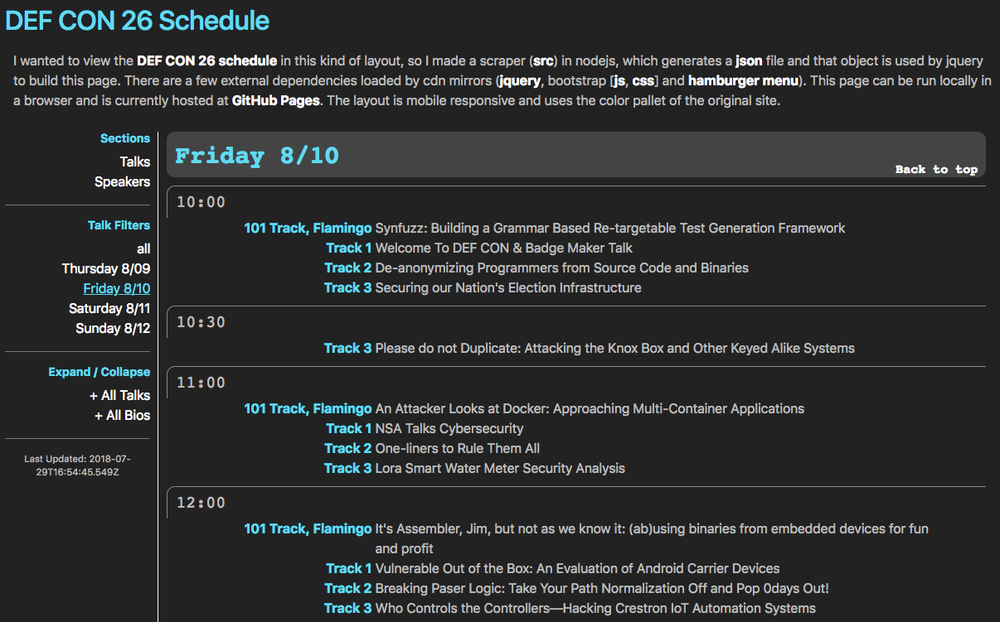
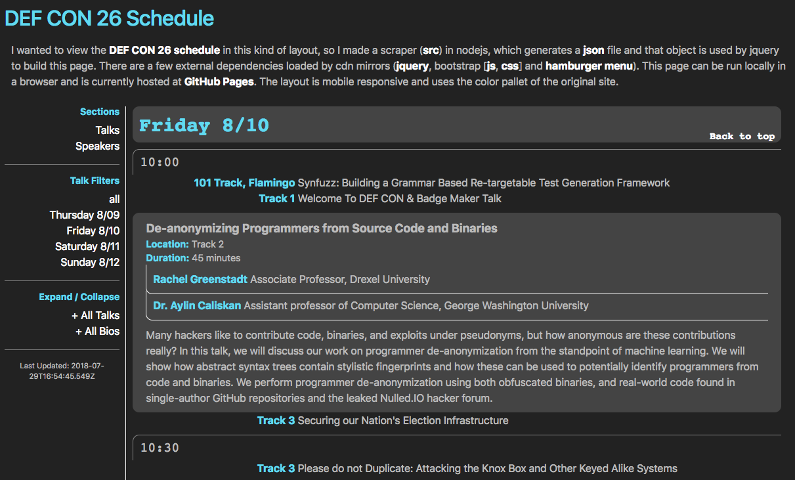
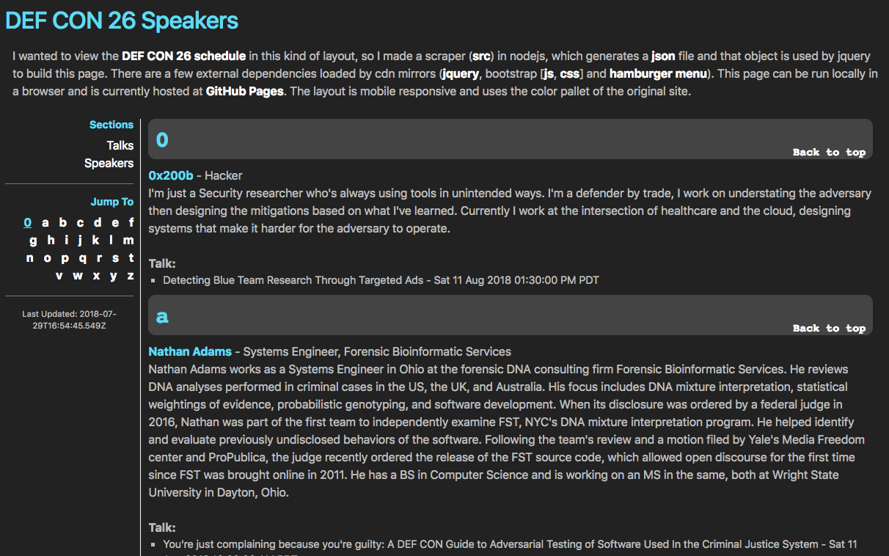
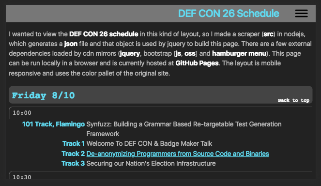
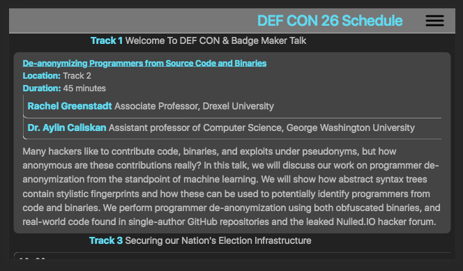
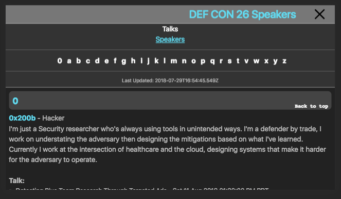
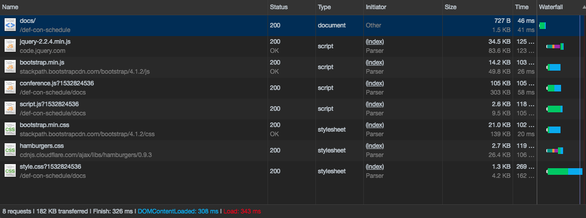

## DEF CON 26 Schedule

Currently this script scrapes the [def con schedule](https://www.defcon.org/html/defcon-26/dc-26-speakers.html) and extracts the data into a json object. The json object that is generated is saved to a hard-coded file named [conference.json](docs/conference.json). I also built a [simple UI](docs) for the data to be displayed and it is currently hosted at [GitHub Pages](https://mathew-fleisch.github.io/def-con-schedule/docs/). The layout is mobile responsive and uses the color pallet of the original site.

### Usage
	npm install
	AS_JS_OBJ=TRUE MINIFIED=TRUE DEBUG_LEVEL=LOG npm start

	# Possible DEBUG_LEVEL levels
	#   - DEBUG_LEVEL=DEBUG  # show errors, warnings, info and debug
	#   - DEBUG_LEVEL=INFO   # show errors, warnings, and info
	#   - DEBUG_LEVEL=WARN   # show errors and warnings
	#   - DEBUG_LEVEL=ERROR  # only show errors
	#   - DEBUG_LEVEL=LOG    # Default

	# The MINIFIED environment variable is a boolean (default: FALSE)
	# that sets whether the output conference.json contains new-lines
	# and tabbing or not.
	# Minified: 295K
	# Standard: 317K

	# The AS_JS_OB environment variable is a boolean (default: FALSE)
	# that saves a stringified JSON object to a js file under the global
	# window.conf scope. Passing false will generate a json file.

### Example Data
Below is an example of how the conference object looks. It is split up into two main sections: speakers, and talks. Each speaker is keyed by a slug of the user's last name followed by any other names. This sorts the speakers by last name within their internal ids. Each talk is keyed by a slug of the title, which sorts them alphabetically. There is a speakers array in each of the 'talks' which can be used to look up bio/title for each user. Time/location information is extracted with regular expression string matching into individual fields. In the case that time/location data cannot be extracted, a 'rawDetails' field is retained for every talk. After the time/location data, the website sometimes shows category information about the talk (i.e. whether it is a demo, exploit or some combination of a few others). I have transformed this csv string as an array of strings named 'tags.' Finally the abstract of each talk contains the original html to preserve paragraph formatting.  

	"conference": {
	    "speakers": {
	        "adams-nathan": {
	            "name": "Nathan Adams",
	            "title": "Systems Engineer, Forensic Bioinformatic Services",
	            "bio": "Biography text..."
	        }
	    },
	    "talks": {
	        "youre-just-complaining-because-youre-guilty-a-def-con-guide": {
	            "speakers": [
	                "adams-nathan"
	            ],
	            "title": "You're just complaining because you're guilty: A DEF CON Guide to...",
	            "fullDate": "Sat 11 Aug 2018 10:00:00 AM PDT",
	            "date": "2018.08.11",
	            "day": "Saturday",
	            "start": "10:00",
	            "duration": 45,
	            "location": "Track 2",
	            "tags": [
	                "Demo"
	            ],
	            "rawDetails": "Saturday at 10:00 in Track 2 45 minutes | Demo",
	            "abstract": "Description about this talk..."
	        }
	    }
	}

### Screenshots

#### Schedule page

#### Schedule page (talk expanded)

#### Speakers page

#### Mobile Schedule page

#### Mobile Schedule page (talk expanded)

#### Mobile Speakers page

#### Stats

